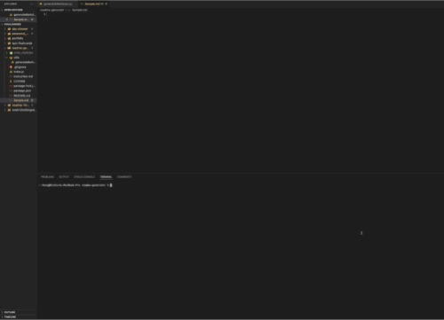
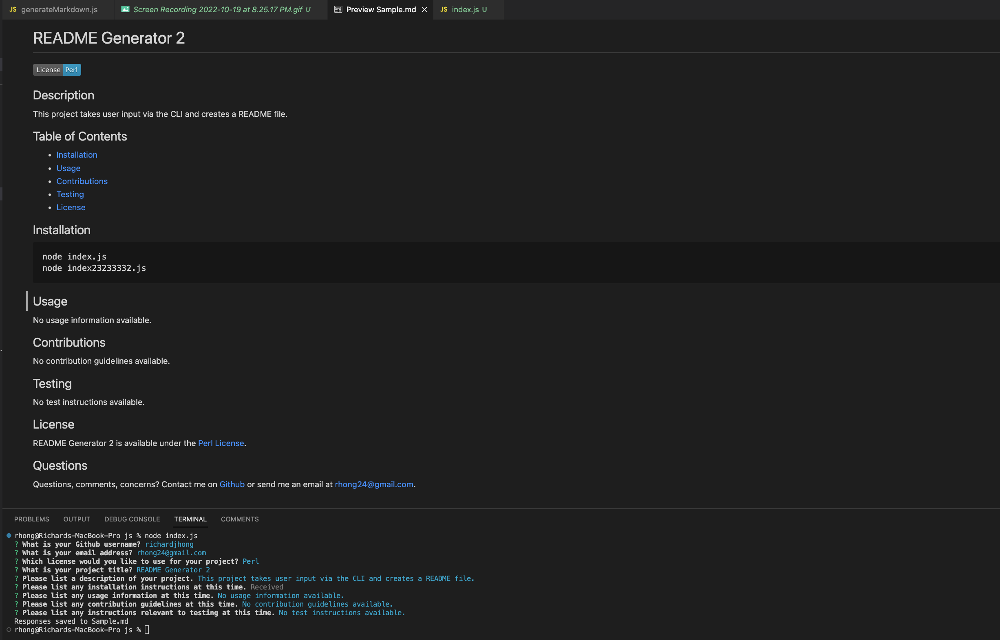

# README Generator

[](https://opensource.org/licenses/MIT)



## Description
As Github repositories typically have a README file to explain the app/project, its installation directions, technologies used, code architecture, etc. to give a high level look at the project, being able to automate this process allows for more efficiency with boilerplate code. As such, this app's purpose is simply to take user input to a series of prompts via the CLI and create a README markdown file according to the responses. 


## Technologies
This app is built with [Node.js](https://nodejs.org/en/), Node.js' native [filesystem](https://nodejs.org/api/fs.html) module, and lastly [Inquirer](https://www.npmjs.com/package/inquirer) npm module (version 8.2.4).


## Table of Contents
  - [Installation](#installation)
  - [Usage](#usage)
  - [Architecture](#architecture)
  - [Screenshot](#screenshot)
  - [License](#license)
  - [Improvements](#improvements)
  - [Questions](#questions)


## Installation

After cloning the repository, user should run the following command within the terminal:
```
npm install
```
Afterwards check towards the bottom within package.json; the user should see inquirer version 8.2.4 as a dependency.

```
...
  "dependencies": {
    "inquirer": "^8.2.4"
  }
```

## Usage
After installing inquirer, the user should run the following commands within the terminal:
```
cd assets/js
node index.js
```
The CLI will ask a series of questions to grab which information to dynamically load into the README file. To change which to save to, the user should replace the "Sample.md" within writeToFile on line 91 of index.js in assets/js.

User should be aware that the prompt 'Please list any installation instructions at this time.' will open the editor within terminal. This was intentional to allow for multi line commands to be written rather than having to create multiple single line inputs. After creating the installation instructions, the user should hit ESC and the following command to escape and save out of the editor:
```
:wq
```


## Architecture
The code is split into two files: the main index.js within assets/js and the generateMarkdown.js file within utils. 
  * index.js has the const variables for inquirer and filesystem modules as well as imports the functions that are exported from generateMarkdown file. The questions array hold the prompts that are passed to inquirer within the init function. Via the use of destructuring, each prompt is passed to inquirer which then passes the return of the promise into writeToFile helper function. writeToFile helper function takes the response from inquirer promise and then writes to the specified file data that has been converted viat he generateMarkdown imported function. If it is successful, the console logs where the responses are saved to; otherwise it will console error the error.
  * generateMarkdown.js has three functions in total that are exported to index.js:
    - renderLicenseBadge creates a clickable badge that links to the respective license type based on a switch statement.
    - renderLicenseSection is used to inform which section to add to the License section of the README within the generateMarkdown function.
    - generateMarkdown function takes data and uses string literal notation to format (with literal indentation) the README file with information added via the destructured inquirer responses.


## Screenshot



## License
This app was licensed under the MIT License.


## Improvements
To deal with the logic on whether to display the license badge as needed within the return of generateMarkdown, I used the [Nullish coalescing operator](https://developer.mozilla.org/en-US/docs/Web/JavaScript/Reference/Operators/Nullish_coalescing_operator). While the usage, contributions, and input prompts have default placeholder responses in the event that the user doesn't explicitly provide any, I'd look further into whether the Nullish coalescing operator can aid in the logic of whether those respective sections are included within the README altogether as needed. Another possible improvement is to include more licenses and look into a more dynamic querying of each license link and badge.


## Questions
Questions, comments, concerns? Contact me on [Github](https://github.com/${username}) or send me an email at rhong24@gmail.com.
